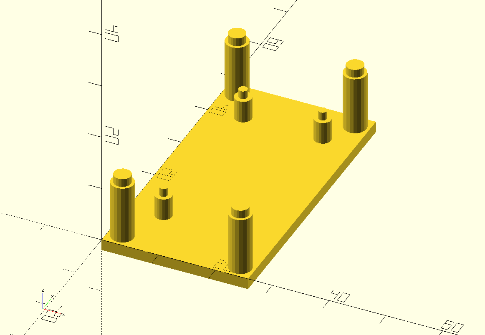
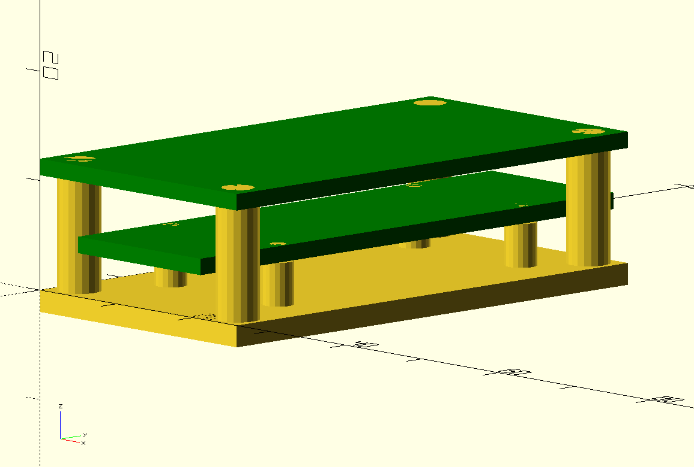
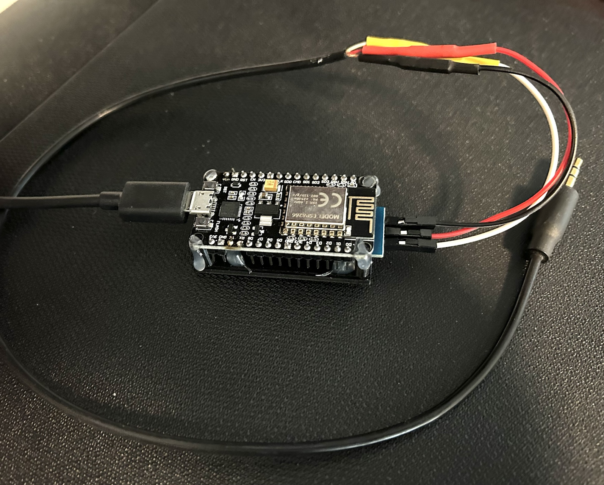

# Samsung TV Serial Console

An [ESPHome](https://esphome.io/) configuration to use an ESP8266 to control a Samsung smart TV's input and power state using Home Assistant via the RS232 ExLink control port

## Problem Statement

The built in Etherenet/WiFi control mechanisms in Samsung smart TV's don't reliably report the TV's power state, and don't support explicitly selecting external inputs (e.g. HDMI2) in an idempotent fashion.

Controlling the TV via its native SmartThings integration can overcome these limitations, but this requires the cloud, and itself has some limitations integrating with Home Assistant.

## Solution

Some Samsung smart TV's have an 3.5mm Ex-Link control jack designed for commercial home automation systems. ESPHome can interface with this port to provide basic, but less brittle, control over the TV's power and input from Home Assistant.

## Limitations

The ExLink port doesn't provide any state information about the TV, so it's not possible to assemble a media card - only buttons for basic functions. Most functions are idempotent however, so they can be used safely in automations.

## Hardware

Ex-Link uses -6V to 6V (12V swing) RS232, so you'll need to connect the UART of an ESPHome compatible target board (such as an ESP8266) to a TTL(3.3V)/RS232 level shifter.

The Rx pin is optional - you can use a unidirectional converter and leave the Rx pin not-connected. The only data sent back by the TV is a one-byte acknowledgment that a command was received. This can be helpful for debugging, but doesn't convey any state information.

The Ex-Link jack is wired as follows:

|Pin 	|Function 		|
|- 		|- 				|
|Tip	|Rx (from TV) 	|
|Ring 	|Tx (to TV)		|
|Base	|Ground 		|

## Software

If you haven't done so already, set up ESPHome on your workstation: https://esphome.io/guides/getting_started_command_line

Customize `tv.yaml` to suit your needs (e.g. rename the TV entity)

Provide a `secrets.yaml` file with the following keys:

	ssid: <Your wifi network name>
	wappw: <Your wifi password>
	hotspotpw: <Create a new password to use for fallback hotspot>
	apipw: <Create a new password to use for authenticating to Home Assistant>

Build and install with ESPHome:

	esphome run tv.yaml

## BOM

**ESP**

I built this using an [ESP8266 NodeMCU board](https://www.amazon.com/HiLetgo-Internet-Development-Wireless-Micropython/dp/B081CSJV2V/), but any ESPHome target board with a UART should suffice.

**Level Shifter**

I built this using [this part](https://www.amazon.com/gp/product/B07BJJ3TZR), but any level shifter that can input 3.3V and output at least a 10V swing (-5V to 5V) should work.

## Enclosure

enclosure/ provides a simple 3D printable enclosure for the ESP8266 and level shifter board.

